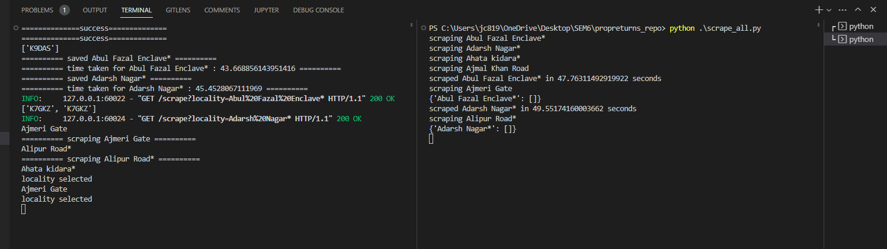

# Internship Assignment


## Problem Statement
Scrape the following Delhi Government website for Real Estate data using Selenium - 
e-Search (delhigovt.nic.in)
You may use the following inputs - 
- SRO: Central -Asaf Ali (SR III)
- Locality: All localities
- Registration Year: 2021-2022
You are required to to scrape the table that comes after searching and store it in dataframe and subsequently store it in an excel file. 
NOTES : 
- Bonus points if you’re able to paginate and scrape all values.
- Bonus points if you’re able to clean and make data uniform (area can be converted into same unit - sq. ft.)
- Bonus points if you can store all this data in a SQL server and make a REST API to query this data.
- Pay due to importance to code quality, code documentation and schema definitions.


## How to run locally
add a .env file with the following variables
```
MYSQL_USER = 'root'         # or any other user
MYSQL_PASSWORD = ''         # or any other password
MYSQL_DB = 'property_data'  # or any other database
MYSQL_TABLE = 'delhi'       # or any other table
MYSQL_HOST = 'localhost'    # or any other host
MYSQL_PORT = 3306           # or any other port
DRIVER_MODE = 'headless'    # or 'headful'
```
To install dependencies, run
```
pip install -r requirements.txt
```

To run the API, run
```
python app.py
```

You can now access the API at http://localhost:8000/

## API Documentation

### GET /localities
Returns a list of all localities
optional query parameter : force_scrape
if force_scrape is set to true, the list of localities will be scraped from the website and stored in the database

Example :
http://localhost:8000/localities?force_scrape=true


### GET /scrape
Scrapes the data for a given locality and stores it in the database
required query parameter : locality
optional query parameter : force_scrape
if force_scrape is set to true, the data will be scraped from the website and stored in the database, else if the data is already stored locally, it will be returned

Example :
http://localhost:8000/scrape?locality="Ajmeri Gate"&force_scrape=true


### GET /upload_to_mysql
Uploads the data for all locally stored localities to the mysql database

Example :
http://localhost:8000/upload_to_mysql


### GET /get_records_by
Returns the records for for given parameter and value
required query parameter : param
required query parameter : value
Examples :

http://localhost:8000/get_records_by?param=locality&value=Ajmeri+Gate

http://localhost:8000/get_records_by?param=area_sq_ft&value=1000

http://localhost:8000/get_records_by?param=registration_date&value=2021-01-08

### To scrape data for all localities
Run the following commands in order
```
python app.py
python scrape_all.py
```
<!-- Output : readme_media/scrape_all.png -->


Note : This will take a long time to run, as it will scrape data for all localities, max workers is set to 4, so 4 localities will be scraped at a time, you can change this in scrape_all.py


You can also have a look at testing.ipynb for a record of complete scrape run.

There are various time.sleep() statements in the code, this is to ensure that the website has enough time to load the data, you can change these values to suit your internet speed. It also prevents the website from blocking the requests, however if you are still getting blocked, you can use a VPN to change your IP address or switch to a different network.

The code can be scaled horizontally by using a load balancer like nginx, and running multiple instances of the API.

## Database Schema
The pandas dataframe.to_sql() method is used to store the data in the database, the schema is automatically generated by pandas, and is as follows

Database : property_data
Table : delhi


desc delhi;

```
registration_number	    bigint(20)	-> Index		
registration_date	    datetime			
first_party	            text	    		
second_party	        text	    		
property_address	    text	    		
area	                text	    		
deed_type	            text	    		
property_type	        text	    		
locality	            text	    		
area_sq_ft	            double	    		
```

### scraped_data folder is intentionally removed from gitingore, so that the data can be viewed on github

## Future Work
- Captcha handling needs improvement, right now it is just pytesseract, which is not very accurate, it can be improved by using a better OCR library, or by using a captcha solving service like 2captcha
- Deploy to AWS Lambda, muliple lambda instances to scrape data for different localities in parallel.